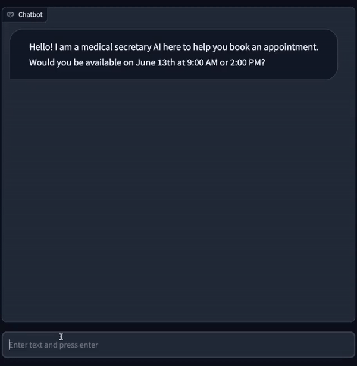
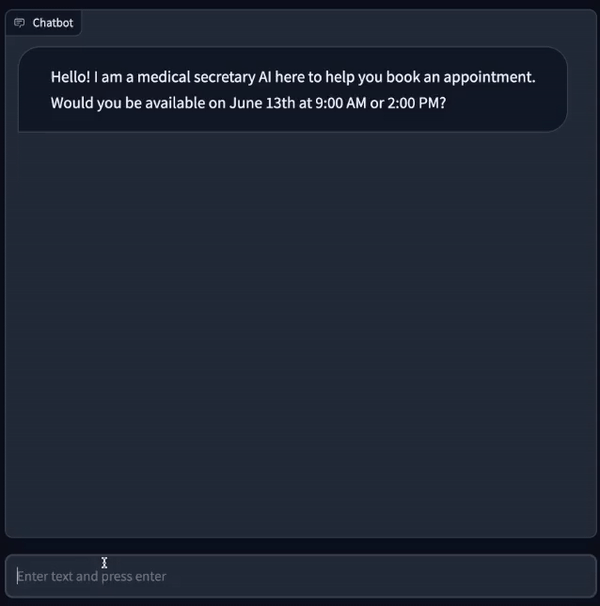

# 🧑 Customer-Service-GPT

## 🎬 Demos

### 📅 Appointment booking

An AI medical assistant helps users book appointments at the clinic by trying to find matching availability, answering questions, and collecting necessary information to confirm the appointment

```bash
poetry run python -m examples.appointment_booking.example_booking_bot
```

<div align="center">

</div>

### 💇 Duplex clone

This bot replicates the Google Duplex demo, in which an AI schedules a hair salon appointment. The AI is the customer assistant and the User is the hair salon attendant.
```bash
poetry run python -m examples.appointment_booking.example_duplex_bot
```


<div align="center">

</div>

What is Customer-Service-GPT?
Customer-Service-GPT is an experimental toolkit designed to build and explore LLM-powered process-driven chatbots. These chatbots guide users through tasks by following step-by-step processes — like opening a bank account or scheduling appointments — making interactions simple and structured.

The project uses modern AI and Python libraries such as Pydantic and Langchain to handle dialogue, context, and entity recognition.

Project Goals
Contextual Named Entity Recognition: Extract relevant information from user inputs by understanding context, e.g., knowing which date/time the user refers to in a list of options.

Dialogue State Management: Manage conversation flow by tracking collected information, validating it, and guiding the user through each step of a process.

Flexible and Extensible: Provide a framework to quickly build custom task-driven chatbots that can be adapted for different domains.

Experimentation Platform: Serve as a playground for testing ideas around conversational AI, entity extraction, and multi-turn dialogue logic.

